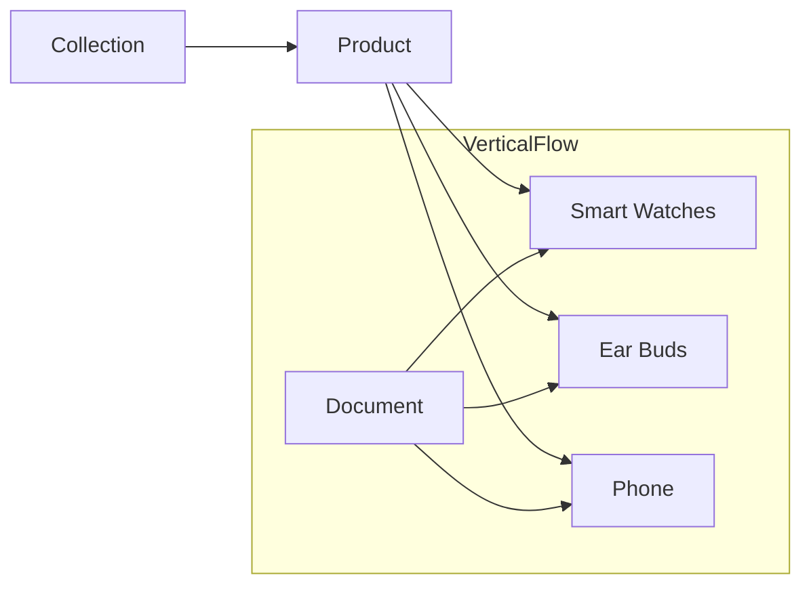

# Roadmap

## Server Setup

1. Run this command to initialize package `npm init -y`
2. Run this command `npm i express mongoose dotenv` 
3. Insert this code after `script:{...},` line
   1. `"type": "module"`
4. Create a folder with a name of `backend` and add a file of `server.js` 
5. Add the following code in `server.js`
   1. ```js
      import express from "express";

      const app = express();

      app.get("/", (req, res) =>{
        res.send('Hi Welcome to the server ')
      })

      app.listen(5000, () =>{
        console.log('server started port on 5000:');
      })
      ```
6. Run this command to add `nodemon` in dev dependency:
   1. `npm i nodemon -D`
7. Add this line in script
   1. ```json
      "scripts": {
        "dev": "nodemon ./backend/server.js"
      },
      ```
  
## Mongo DB setup

1. Create a file name with `.env` in the **root** folder.
   1. Copy this code: `MONGODB_URI=`
2. Signup for MongoDB page [MonogoDB Sign Up](https://www.mongodb.com/community/forums/signup)
3. Create a `Cluster`
4. Click on **FREE option** > **Create Deployment**
5. Copy `Password`, later w'll use it.
6. Select the button **Database user** > **Choose a connection method**
7. Click on **Drivers** > Select `node.js`.
8. Wait a while, you'll see the **connection string**. Copy it.
9. Paste the **string** besige the `MONGODB_URI=<YOUR_STRING>`
   1.  If `<password>` is not available in string, then add password into the string. 
10. Click on the **Network Access** on left side menu > **Add IP address** > **Allow access from anywhere** > **Confirm**
11. Now modify the `server.js` as shown below:
    1.  ```js
        import express from "express";
        import dotenv from "dotenv";

        const app = express();

        dotenv.config();

        app.get("/", (req, res) =>{
          res.send('Hi Welcome to the server ')
        })

        // for development use
        console.log(process.env.MONGODB_URI)

        app.listen(5000, () =>{
          console.log('listening port on 5000:');
        })
        ```

### Connecting the db

1. Create a `config/db.js` in **backend** folder.
2. Copy this code and write into `db.js` file:
    1.  ```js
         import mongoose from "mongoose";

         export const connectDB = async () => {
            try {
               const conn = await mongoose.connect(process.env.MONGODB_URI);
               console.log('MongoDB connected',conn.connection.host);
            } catch (error) {
               console.error('Server ERRRO:',error.message);
            }
         }
         ```
3. Now write this code in `server.js`:
   1. ```js
      // ....
      import { connectDB } from "./config/db.js";

      // .....
      app.listen(5000, () =>{
         connectDB();                // <------- call the MongoDB function
         console.log('listening port on 5000:');
      })
      ```

## Creating the Database

### SQL vs MongoDB

| Feature                  | SQL (Relational Databases)                            | MongoDB (NoSQL Document Database)             |
|--------------------------|------------------------------------------------------|-----------------------------------------------|
| **Data Model**           | Relational, table-based (rows and columns)           | Document-oriented (JSON-like BSON format)     |
| **Schema**               | Fixed schema, predefined structure                   | Flexible schema, dynamic documents            |
| **Query Language**       | SQL (Structured Query Language)                      | MongoDB Query Language                        |
| **ACID Compliance**      | Strong ACID compliance                               | Supports ACID at document level               |
| **Joins**                | Supports complex joins                               | No joins (joins done within application code) |
| **Scalability**          | Vertical scalability (scale-up)                      | Horizontal scalability (scale-out)            |
| **Performance**          | Suited for complex transactions and queries          | Suited for high read/write workloads          |
| **Storage**              | Row-based storage                                    | Document-based storage                        |
| **Transactions**         | Supports multi-row, multi-table transactions         | Multi-document transactions (since v4.0)      |
| **Data Integrity**       | Enforces data integrity with foreign keys, constraints | No strict data integrity enforcement          |
| **Use Cases**            | Suitable for complex querying, financial systems     | Best for real-time analytics, content management |
| **Examples**             | MySQL, PostgreSQL, Oracle                            | MongoDB                                       |

### Example: Product



### Product model

1. Create a file in the this folder `/backend/models/product.model.js`
2. Add this `schema` code into the `product.model.js` file
   1. ```js
      import mongoose from "mongoose";

      const productSchema = new mongoose.Schema(
         {
            name: {
               type: String,
               required: true,
            },
            price: {
               type: Number,
               required: true,
            },
            image: {
               type: String,
               required: true,
            },
         },
         {
            timestamps: true, // createdAt, updatedAt <optional>
         }
      );

      const Product = mongoose.model("Product", productSchema);

      export default Product;
      ```
3. Now we have to create a API for `post` Product data.
4. Copy the code from the below and paste into the `server.js` file:
   1. ```js

      app.use(express.json());                                       // It's a middle ware that parses the request.body into json
      app.post("/api/products", async (req, res) => {                // best practice to use api/..
         const product = req.body;                                   // user will send this data

         if (!product.name || !product.price || !product.image) {
            return res.status(400).json({ success: false, message: "Please provide all fields" });
         }

         const newProduct = new Product(product);                     // ./models/product.model.js

         try {
            await newProduct.save();
            res.status(201).json({ success: true, data: newProduct });
         } catch (error) {
            console.error("Error in Create product:", error.message);
            res.status(500).json({ success: false, message: "Server Error" });
         }
      });
      ```
5. Try in [Postman](https://www.postman.com/downloads/) for testing purpose.
   1. Open **Postman**
   2. use `POST` method
   3. url: `https://localhost:5000/api/products`
   4. Select **Body**, then select **raw** and `JSON`
   5. Copy the code and paste in `body` form editor and then send.
      1. ```json
         {
            "name":"Smart Watch"
            "price":"199.99"
            "image":"example.com/image"
         }
         ```
   6. You'll get `success` message. Try with some another messages.

6. 
